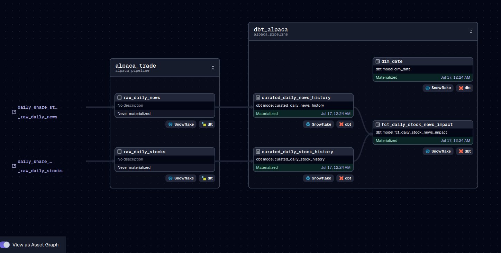

# 🦙 Alpaca Trade Data Pipeline

This project implements an end-to-end data pipeline that retrieves trading data and market news from the [Alpaca API](https://alpaca.markets/), loads it into **Snowflake** using [dlt](https://github.com/dlt-hub/dlt), orchestrates the process with **Dagster**, and transforms the raw data into analytical models using **dbt**.

---

## Tech Stack

- **[dlt](https://docs.dlt.dev/)** – Python-based ELT framework for loading data into Snowflake
- **[Dagster](https://dagster.io/)** – Modern orchestrator for data assets and pipelines
- **[dbt](https://docs.getdbt.com/)** – SQL-based transformation framework
- **Docker + Docker Compose** – Containerized development environment
- **Snowflake** – Cloud data warehouse (destination)

---

## 📁 Project Structure

```bash
trade_pipeline/
│
├── .dlt/   # dlt secrets & source config
│   ├── sources/
│   ├── config.toml
│   └── secrets.toml
│
├── dagster/          
│   └── alpaca_pipeline/
│       ├── assets/
│       │   ├── alpaca_dbt_assets.py
│       │   └── alpaca_dlt_assets.py
│       ├── jobs.py
│       ├── schedules.py
│       └── __init__.py
│   ├── dagster.yaml
│   ├── Dockerfile
│   ├── requirements.txt
│   └── workspace.yaml
│
├── dbt_alpaca/           
│   ├── models/
│   ├── macros/
│   ├── seeds/
│   ├── snapshots/
│   ├── target/
│   ├── tests/
│   ├── dbt_project.yml
│   └── profiles_example/
│
├── dlt_pipeline/
│   ├── helpers.py             
│   ├── resource.py             
│   ├── settings.py           
│   ├── Dockerfile
│   ├── requirements.txt
│   └── __init__.py
│
├── docker-compose.yml
├── image.png   # Dagster lineage screenshot
└── README.md


```
---

##  Docker Compose Setup

This project is implemented using a `docker-compose.yml` file that sets up a multi-container environment to run the ETL pipeline and supporting services. The stack consists of the following components:

- **PostgreSQL**: Serves as the metadata and configuration store for dagster pipelines.
- **dlt**: Handles building DLT pipeline image and execution.
- **Dagster**: Provides the orchestration and execution engine for managing ELT workflows.
- **dagster_webserver**: The web-based UI for Dagster, used to monitor and trigger pipelines.

All services are configured to run in an isolated Docker network and communicate internally. Environment variables are used to configure credentials and settings for secure and flexible deployment.


###  Getting Started

To launch the project, run the following command from the project root directory:

```bash
docker-compose up --build

```
To stop the project, run the following command from the project root directory:
```bash 
  docker-compose down
```
To retard the project, run the following command stopCMD; launch CMD from the project root directory:

```bash
  docker-compose down; docker-compose up --build
```

---


# 📊 DLT Pipeline for Alpaca 

This`dlt_pipeline` that retrieves **daily stock statistics** and **daily share news** from the **Alpaca API** using **OAuth2 authentication**.


1. The pipeline starts by sending an initial **GET request** to the Alpaca API to fetch both `daily_stock_statistics` and `daily_share_news`.

2. It then uses **pagination** to collect the complete set of results.

3. Once all pages are retrieved, the data is **flattened** to a structured format.

4. The processed data is **yielded to a DLT resource** using the `@dlt.resource` decorator.

5. Both resources (stock statistics and news) are combined into a single **DLT source** using the `@dlt.source` decorator.

6. This unified source is then passed to **Dagster**, which orchestrates and runs the pipeline.

## ⚙️ Features

- Retrieves data from the Alpaca API using OAuth2
- Handles pagination to ensure complete data retrieval
- Flattens nested JSON responses for consistency
- Combines multiple data resources into a single source
- Seamlessly integrates with Dagster for orchestration


## 📁 Required Configuration: `secrets.toml`

To run the pipeline, you must create a `secrets.toml` file with the required credentials for both the data **destination** (e.g., Snowflake) and the **source** (Alpaca API).

```toml
# Destination configuration for Snowflake
[destination.snowflake.credentials]
database = "******"         # fill this in!
password = "********"       # fill this in!
username = "*****"          # fill this in!
host = "*********"          # fill this in!
warehouse = "******"        # fill this in!
role = "*******"            # fill this in!

# Source configuration for Alpaca API
[sources.credentials]
API_KEY = "alpaca_key"              # fill this in!
SECRET_KEY = "alpaca_secret_key"    # fill this in!
```
---



